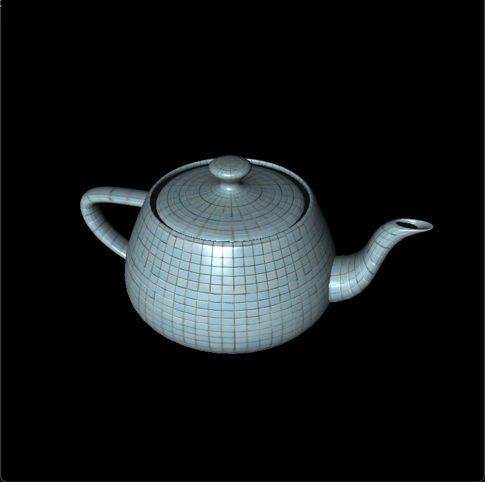
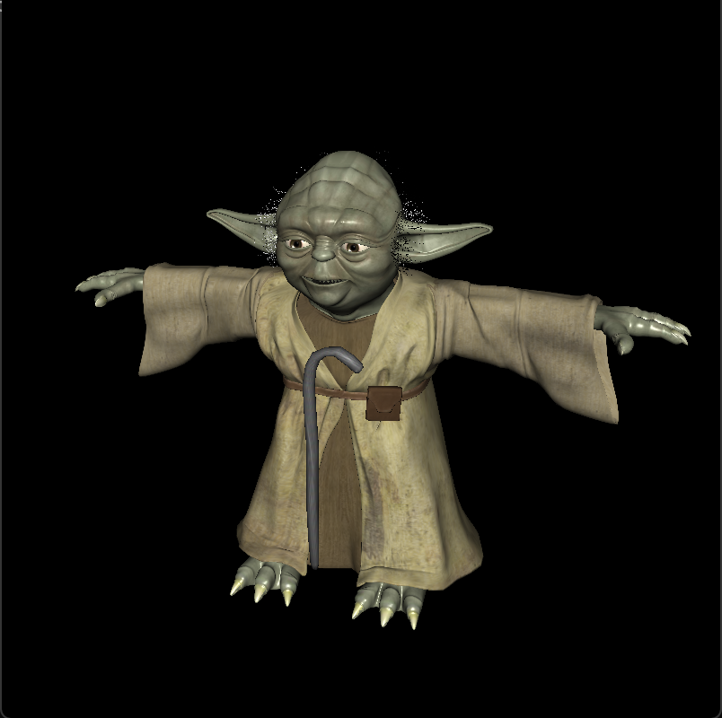
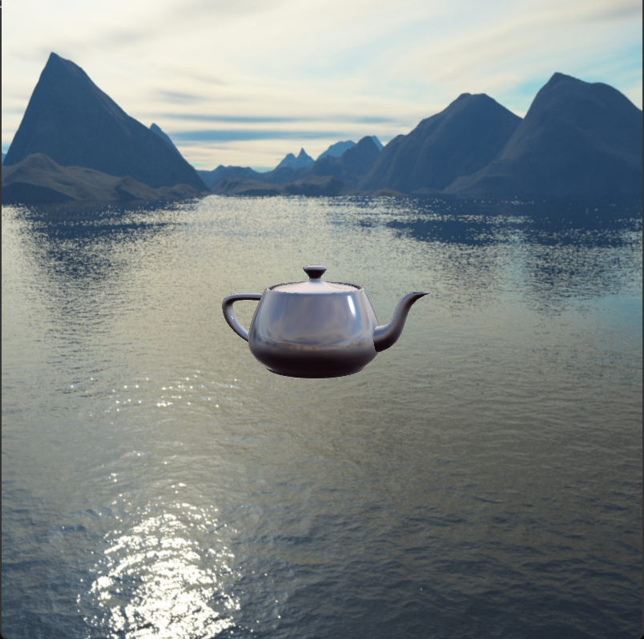

# Model-Viewer
A 3D obj model viewer using OpenGL and C++  
The programs takes the name of the **obj** file as an argument.
Models with multiple materials is supported.  
Currently, only these parameters of the material is used in shading: Ka, Kd, Ks, Ns, map_Ka, map_Kd, map_Ks.  

Hold left mouse button and drag to rotate the model.  
Hold down LCTRL + left mouse button and drag to rotate the light source around the model.  
Hold right mouse button and drag to change the camera distance.  

[stb_image.h](https://github.com/nothings/stb/blob/master/stb_image.h) was used for loading textures.  
[cyTriMesh.h](https://github.com/cemyuksel/cyCodeBase/blob/master/cyTriMesh.h) was used for reading model data.  
[GLM](https://glm.g-truc.net/0.9.8/index.html) library was used for the 3D mathematics.
The project uses OpenGL 4.6.

A demo of the project can be found [here](https://youtu.be/ZYSf9GgbSG4)  

The famous Utah teapot    
  

Also this yoda with 7 materials

UPDATE:
Cubemaps and environment mapping now supported. Press C/V to activate/deactivate cubemaps.  

